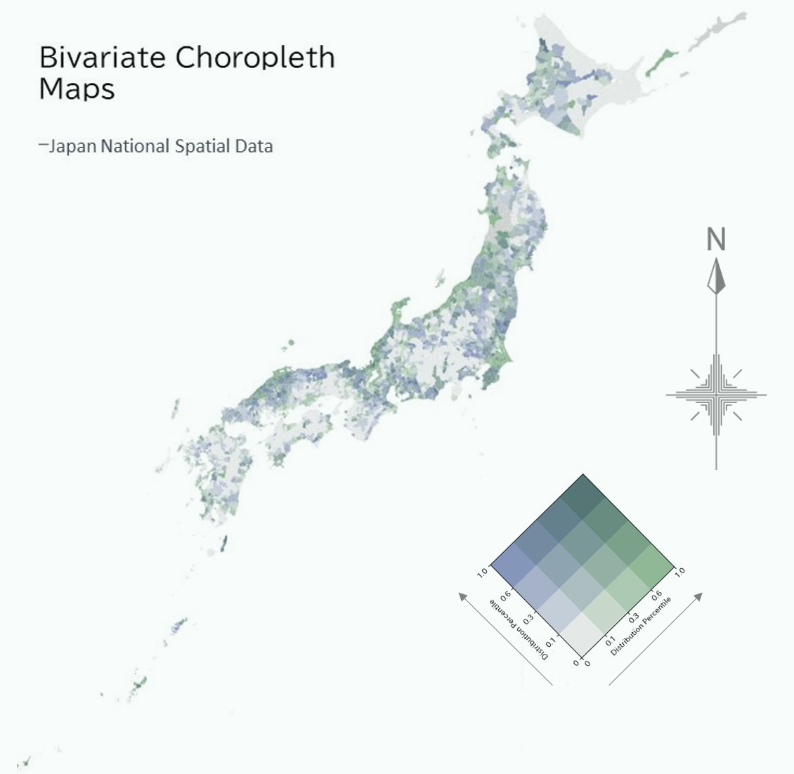

## Japan Bivariate Choropleth Maps
This project provides samples and source code examples of a bivariate choropleth map created using National Land Numerical Information. A bivariate choropleth map is an effective technique for visualizing two different variables (bivariate) on geographic space.

↓Open-source GIS data(polygon) of (Ministry of Land, Infrastructure, Transport and Tourism : MLIT)
https://nlftp.mlit.go.jp/ksj/gml/datalist/KsjTmplt-N03-v3_1.html

※The data being displayed here is dummy data! We do not provide sample data for visualization, so please try with your own data.
